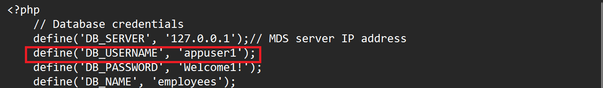

# SECURITY - MYSQL USERS

## Introduction

Users management
Objective: explore user creation and privileges on a Server

*This lab walks you through creating some users which will be used to Audit.

Estimated Time: 10 minutes

### Objectives

In this lab, you will  do the followings:

- Connect to mysql-enterprise
- Create appuser

### Prerequisites

This lab assumes you have:

- All previous labs successfully completed

### Lab standard

Pay attention to the prompt, to know where execute the commands 
*  shell>  
  The command must be executed in the Operating System shell
*  mysql>  
  The command must be executed in a client like MySQL, MySQL Shell or similar tool
*  mysqlsh>  
  The command must be executed in MySQL shell


**Notes:**

- This lab it's easier using 2 shell sessions, one for administrative commands, one for user activities


## Task 1: Connect to mysql-enterprise on Server

1. Connect to your mysql-enterprise with administrative user

    ** shell>**

    ```
    <copy>mysqlsh admin@127.0.0.1</copy>
    ```

2. Create a new user and restrict the user to your “Server” IP

 a. ** mysqlsh>**

    ```
    <copy>CREATE USER 'appuser1'@'127.0.0.1' IDENTIFIED BY 'Welcome1!';</copy>
    ```

 b. ** mysqlsh>**

    ```
    <copy>GRANT ALL PRIVILEGES ON employees.* TO 'appuser1'@'127.0.0.1';</copy>
    ```

 c. ** mysqlsh>**

    ```
    <copy>SHOW GRANTS FOR 'appuser1'@'127.0.0.1';</copy>
    ```

## Task 2: Connect to the Employee App using  `appuser1`@`127.0.0.1`

1. Open ***another terminal window*** or exit MySQL command. 

    Go to the development folder

    ** shell>**

    ```bash
    <copy>cd /var/www/html/emp_apps</copy>
    ```

2. Replace the username and server  in config.php file with **appuser1** then save the file.

    ** shell>**

    ```bash
    <copy>sudo nano config.php</copy>
    ```
    

3. Run the application as follows:

    http://computeIP/emp_apps/list_employees.php

## Task 3: Use appuser1 connection 

1. In the second shell connect as appuser1 (save the password ***Welcome1!*** to simplify next connections)

    ** shell>**

    ```
    <copy>mysqlsh appuser1@127.0.0.1</copy>
    ```

    ** mysqlsh>**

    ```
    <copy>USE employees;</copy>
    ```

    ** mysqlsh>**

    ```
    <copy>SELECT * FROM employees LIMIT 5;</copy>
    ```

2. Switch to the administrative connection revoke ‘USAGE’ privilege using and administrative connection and verify (tip: this privilege can’t be revoked…  this command doesn't actually change any privileges because USAGE doesn't grant any permissions)

    ** mysqlsh>**

    ```
    <copy>REVOKE USAGE ON *.* FROM 'appuser1'@'127.0.0.1';</copy>
    ```
    ** mysqlsh>**

    ```
    <copy>SHOW GRANTS FOR 'appuser1'@'127.0.0.1';</copy>
    ```

3. Run the application as follows (The application should run):

    http://computeIP/emp_apps/list_employees.php

4. Return to application connections and check which databases are seen
    ** mysqlsh>**
    ```
    <copy>SHOW DATABASES;</copy>
    ```

5. Using the administrative connection revoke all privileges using and administrative connection and verify

    ** mysqlsh>**
    ```
    <copy>REVOKE ALL PRIVILEGES ON *.* FROM 'appuser1'@'127.0.0.1';</copy>
    ```

    ** mysqlsh>**

    ```
    <copy>SHOW GRANTS FOR 'appuser1'@'127.0.0.1';</copy>
    ```

6. Return to application connections and check which databases are seen (please note that employees database is now missing)  
    ** mysqlsh>**
    ```
    <copy>SHOW DATABASES;</copy>
    ```

7. Run the application as follows (The application will not run):

    http://computeIP/emp_apps/list_employees.php

## Task 4: Restore user privileges 

1. Using the administrative connection restore user privileges to reuse it in next 

    ** mysqlsh>**

    ```
    <copy>GRANT ALL PRIVILEGES ON employees.* TO 'appuser1'@'127.0.0.1';</copy>
    ```

2. Run the application as follows (The application will run):

    http://computeIP/emp_apps/list_employees.php


You may now **proceed to the next lab**

## Learn More

- [CREATE USER](https://dev.mysql.com/doc/en/create-user.html)
- [MySQL Access Control Lists](https://dev.mysql.com/doc/en/access-control.html)

## Acknowledgements

- **Author** - Dale Dasker, MySQL Solution Engineering
- **Last Updated By/Date** - Perside Foster, MySQL Solution Engineering, August 2024
